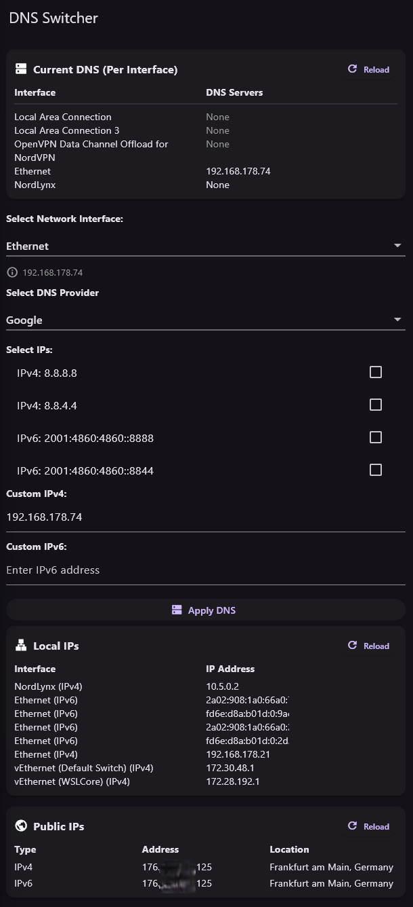

## 📡 DNS Switcher

A cross-platform **Flutter** app to manage system DNS settings on **Windows, macOS, Linux**, and **Android**. It supports IPv4 & IPv6, common DNS presets (Google, Cloudflare, OpenDNS), and custom DNS input. Built with clean architecture.

---

### 🖥️ Features

* ✅ Show current **local and public IPs** (IPv4 + IPv6)
* ✅ Detect and list **all network interfaces**
* ✅ Auto-select most active interface
* ✅ Fetch and show **per-interface DNS** configuration
* ✅ Apply DNS to selected interface
* ✅ Select from presets (Google, Cloudflare, OpenDNS)
* ✅ Custom DNS input fields
* ✅ **Persist custom IPs** using SharedPreferences
* ✅ UI in modern Material 3 style with dark/light mode
* ✅ Tooltip with **country info** beside IPs
* ✅ Reload status manually or automatically
* ✅ Run with elevated privileges (Windows)

---

### 📦 Download

🪟 **[Download latest Windows version (.exe)](https://github.com/your-username/dns_switcher/releases/latest)**  
➡️ Get the executable from the latest release on GitHub.

---

### 📱 Screenshots



---

### 🚀 Getting Started

#### Prerequisites

* [Flutter 3.13+](https://flutter.dev/docs/get-started/install)
* Developed with Flutter **3.32.0**
* Windows / Linux / macOS or Android device
* For Windows: **Run as Administrator** to apply DNS

#### Installation (for developers)

```bash
git clone https://github.com/your-username/dns_switcher.git
cd dns_switcher
flutter pub get
````

---

### 🧪 Run the App

#### Windows (recommended with admin)

```bash
flutter run -d windows
```

> 🔒 Note: System DNS change is **only implemented on Windows** in this version.

---

### 📁 Folder Structure

```
lib/
├── core/                   # Abstract interfaces
├── models/                 # Data classes like DnsPreset
├── platform/               # Platform-specific logic (e.g., windows_dns.dart)
├── services/               # DnsService (main logic)
├── widgets/                # UI components
├── screens/                # Main screen (HomeScreen)
```

---

### 🗂 DNS Presets Format

Located in `assets/dns_presets.json`:

```json
[
  {
    "label": "Google",
    "ipv4": ["8.8.8.8", "8.8.4.4"],
    "ipv6": ["2001:4860:4860::8888", "2001:4860:4860::8844"]
  }
]
```

---

### 🔧 Admin Privileges (Windows)

Run the app as administrator for applying DNS settings.

---

### 🔮 TODO

* [ ] macOS/Linux/Android support for DNS setting
* [ ] Elevated permission handling for macOS/Linux/Android
* [ ] Service to auto-restore previous DNS on boot

---

### 🧑‍💻 Developed By

**Mohammad Shariat**
[Shariat.de](https://shariat.de) | [GitHub](https://github.com/shariati)

---

### 📜 License

MIT License. See [`LICENSE`](LICENSE) file.

